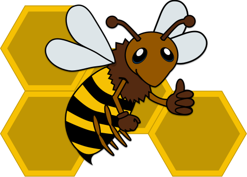

  

<h1 align="center">
  Honeycomb
</h1>

  <strong>Honeycomb</strong> is a common basis for <a href="https://nodejs.org">Node.js</a> microservices 🐝

  Busy bees are working hard to get things done. This project is not ready for prime time.

  
  

## Packages

| Name | Description |
|------|-------------|
| [eslint-config-honeycomb](./packages/eslint-config-honeycomb) | ESLint shareable config for Honeycomb |
| [generator-honeycomb](./packages/generator-honeycomb) | Yeoman generator for Honeycomb services |
| [honeycomb-assets](./packages/honeycomb-assets) | Mircoservice for global assets
| [honeycomb-health-middleware](./packages/honeycomb-health-middleware) | Health endpoint for Honeycomb |
| [honeycomb-info-middleware](./packages/honeycomb-info-middleware) | Info endpoint for Honeycomb |
| [honeycomb-layout](./packages/honeycomb-layout) | Layout service for Honeycomb |
| [honeycomb-logging-middleware](./packages/honeycomb-logging-middleware) | Logging middleware for Honeycomb |
| [honeycomb-registry-client](./packages/honeycomb-registry-client) | Service registry client for Honeycomb |

## Development

| Command | Description |
| --------|-------------|
| `npm run install` | Install the dependencies from all packages |
| `npm run test` | Run the tests from all packages |
| `npm run clean` | Remove the `node_modules` directory from all packages |
| `npm run generate` | Generate example honeycomb services (`packages/example-*`) |

### Docker

| Command | Description |
| --------|-------------|
| `npm run docker:build` | Build the dist version for `packages/honeycomb-layout` and `packages/example-*` |
| `docker-compose up` | Create and start containers |

## License

Copyright (c) 2016-2017 Daniel Bayerlein. See [LICENSE](./LICENSE.md) for details.
